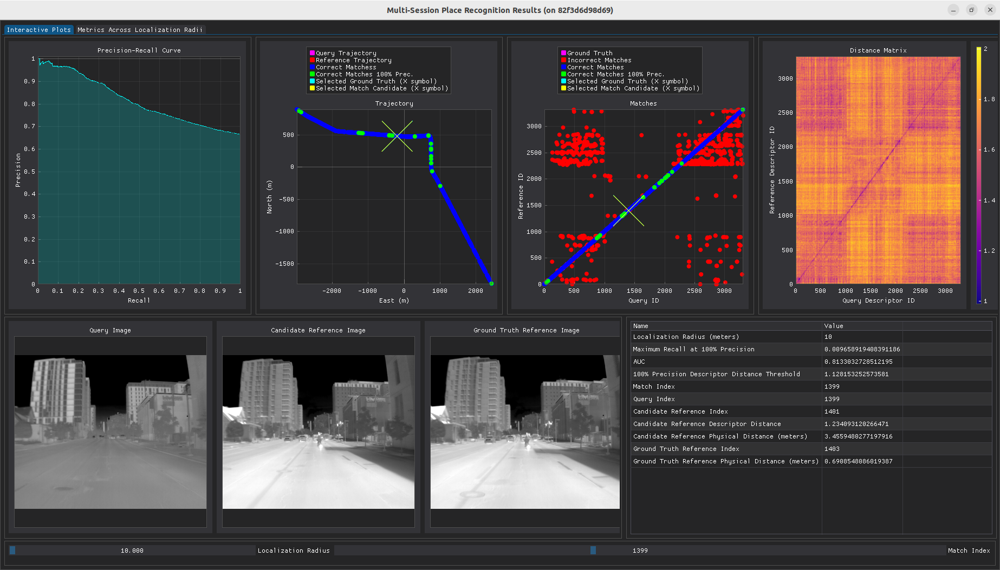

# Place Recognition

We provide a script to run place recognition with NetVLAD and an algorithm-agnostic script and GUI to evaluate place recognition results.

# 1. Setup

We recommend building and running the place recognition code with Docker. This section describes Docker installation, building the `nsavp_place_recognition` Docker image, and running the image with an interactive bash session. The following has been tested with Ubuntu 22.04.

To begin, install [Docker Engine](https://docs.docker.com/engine/install/ubuntu/) and perform [this](https://docs.docker.com/engine/install/linux-postinstall/#manage-docker-as-a-non-root-user) post-installation step. Then, if applicable, update your NVIDIA drivers and install the [NVIDIA Container Toolkit](https://docs.nvidia.com/datacenter/cloud-native/container-toolkit/latest/install-guide.html) to allow your NVIDIA GPU(s) to be accessed from within Docker containers.

After installing Docker, a Docker image for running the code described in this page can be built as follows:
```
cd nsavp_tools/
docker build -t nsavp_place_recognition -f docker/Dockerfile_place_recognition .
```
The result will be a new Docker image named `nsavp_place_recognition` with the `nsavp_tools/place_recognition/` folder copied into the `/place_recognition/` directory within the image.

All commands in subsequent sections are run through an interactive bash session in a Docker container running the `nsavp_place_recognition` image. The following commands will run the image and start an interactive bash session in the running container:
```
xhost +
docker run -it --gpus all -e DISPLAY=$DISPLAY -v /tmp/.X11-unix:/tmp/.X11-unix -v /path/to/nsavp/data/:/nsavp_data nsavp_place_recognition
```
The arguments `-e DISPLAY=$DISPLAY -v /tmp/.X11-unix:/tmp/.X11-unix` are included to allow display windows to be opened from within the container. The argument `--gpus all` allows access to all GPUs on the host machine from within the container and can be modified to limit the GPUs accessible or omitted entirely if no GPUs are available. The `/path/to/nsavp/data/` path should be replaced with the folder storing NSAVP data on your host machine. This folder will appear within the container as the `/nsavp_data` folder. Once finished, the interactive session can be exited with `Ctrl+D` and the container can be removed by first finding it's name with `docker ps` and then removing it with `docker rm <container name>`.

# 2. Running NetVLAD

The `netvlad_place_recognition.py` script runs multi-session place recognition between two NSAVP sequences with NetVLAD.

The `netvlad_place_recognition.py` script takes the following arguments:
- Positional arguments
    - `path_h5_query_images`: A filepath to the query sequence image H5 file.
    - `path_h5_query_poses`: A filepath to the query sequence pose H5 file.
    - `path_calibration_results_query`: A filepath to the query sequence calibration YAML file.
    - `path_h5_reference_images`: A filepath to the reference sequence image H5 file.
    - `path_h5_reference_poses`: A filepath to the reference sequence pose H5 file.
    - `path_calibration_results_reference`: A filepath to the reference sequence calibration YAML file.
    - `path_output_folder`: A path specifying a folder to write the place recognition results and settings to.
- Optional arguments:
    - `--position-endpoint-0`: A list specifying the ECEF position of the first route endpoint (in meters). The descriptors will be drawn between the two endpoints. Defaults to `512123.256980 -4698109.353169 4269242.045445`.
    - `--position-endpoint-1`: A list specifying the ECEF position of the second route endpoint (in meters). The descriptors will be drawn between the two endpoints. Defaults to `517731.144315 -4699324.549431 4267227.657290`.
    - `--spacing`: A float specifying the spacing between the descriptors. Defaults to `2.0`.
    - `--save-distance-matrix`: An argument specifying that the distance matrix should be saved.

> Note: The ground truth pose H5 files are used only to ensure descriptors are formed at places uniformly spaced apart (see the `--spacing` argument) and within the desired subset of the route (see `--position-endpoint-0` and `--position-endpoint-1`). This avoids, for example, multiple descriptors being formed while the car is stationary at a stoplight. In practice, odometry could be used to ensure the equal spacing of the descriptors.

For example, if the files `R0_RN0_adk_left.h5`, `R0_RN0_applanix.h5`, and `R0_RN0_C1_calibration_results.yaml` are located in the folder `/nsavp_data/R0_RN0/` and `R0_RA0_adk_left.h5`, `R0_RA0_applanix.h5`, and `R0_RA0_C1_calibration_results.yaml` are located in the folder `nsavp_data/R0_RA0/` within the running Docker container (see [Setup](#1-setup)) the following command will apply NetVLAD with the queries drawn from the R0_RN0 sequence and the reference database formed from the R0_RA0 sequence:
```
python3 place_recognition/netvlad_place_recognition.py /nsavp_data/R0_RN0/R0_RN0_adk_left.h5 /nsavp_data/R0_RN0/R0_RN0_applanix.h5 /nsavp_data/R0_RN0/R0_RN0_C1_calibration_results.yaml /nsavp_data/R0_RA0/R0_RA0_adk_left.h5 /nsavp_data/R0_RA0/R0_RA0_applanix.h5 /nsavp_data/R0_RA0/R0_RA0_C1_calibration_results.yaml /nsavp_data/results/ --save-distance-matrix
```
The result would be a new folder, `/nsavp_data/results/`, containing the following files:
- `timestamps_query.txt`: The TAI timestamps of the query place descriptors.
- `timestamps_reference.txt`: The TAI timestamps of the reference place descriptors.
- `match_candidates.json`: A JSON file containing:
    - `query_ids`: A list of indices for the query place descriptors. The indices correspond to entries in the `timestamps_query.txt` file.
    - `reference_ids`: A list (with the same length as `query_ids`) of indices for the reference place descriptors. The indices correspond to entries in the `timestamps_reference.txt` file. These reference indices are match candidates for the corresponding query indices.
    - `distances`: A list (with the same length as `query_ids`) containing the descriptor distances between the corresponding query and reference place descriptors.
- `arguments.json`: A JSON file containing the arguments passed to the `netvlad_place_recognition.py` script.
- `distance_matrix.txt`: The values of the distance matrix computed between the query and reference place descriptors. The references are indexed down the rows and the queries are indexed across the columns.

# 3. Evaluating Results

The `evaluation.py` script computes place recognition metrics and launches a GUI that can be used to step through the results. The script is algorithm-agnostic and only requires that the place recognition output be formatted as described above in [Running NetVLAD](#2-running-netvlad) (see the descriptions of the `timestamps_query.txt`, `timestamps_reference.txt`, and `match_candidates.json` files).

The `evaluation.py` script takes the following arguments:
- Positional arguments
    - `path_timestamps_query`: A filepath to the `timestamps_query.txt` file.
    - `path_timestamps_reference`: A filepath to the `timestamps_reference.txt` file.
    - `path_ground_truth_query`: A filepath to the query sequence ground truth pose H5 file.
    - `path_ground_truth_reference`: A filepath to the reference sequence ground truth pose H5 file.
    - `path_measured_extrinsics_query`: A filepath to the query sequence measured extrinsics YAML file.
    - `path_measured_extrinsics_reference`: A filepath to the reference sequence measured extrinsics YAML file.
    - `namespace_query`: Query sensor namespace (e.g. `mono_left`).
    - `namespace_reference`: Reference sensor namespace (e.g. `mono_left`).
    - `path_match_candidates`: A filepath to the `match_candidates.json` file.
- Optional arguments:
    - `--localization-radii`: A list specifying the localization radii to use (in meters). The format is `start stop step`. Defaults to `5 30 1`.
    - `--path-distance-matrix`: A filepath to the `distance_matrix.txt` file. If given, the distance matrix will be displayed.
    - `--path-images-query`: A filepath to the query sequence image H5 file. If given along with `--path-images-reference` the images will be displayed in the GUI.
    - `--path-images-reference`: A filepath to the reference sequence image H5 file. If given along with `--path-images-query` the images will be displayed in the GUI.
    - `--path-descriptors-query`: A filepath to a query descriptor txt file. If given along with `--path-descriptors-reference`, `--n-descriptor-rows`, and `--n-descriptor-cols`, the descriptors will be displayed. Intended to be used with matrix descriptors (e.g. Scan Context).
    - `--path-descriptors-reference`: A filepath to a reference descriptor txt file. If given along with `--path-descriptors-query`, `--n-descriptor-rows`, and `--n-descriptor-cols`, the descriptors will be displayed. Intended to be used with matrix descriptors (e.g. Scan Context).
    - `--n-descriptor-rows`: Descriptor height. If given along with `--path-descriptors-query`, `--path-descriptors-reference`, and `--n-descriptor-cols`, the descriptors will be displayed.
    - `--n-descriptor-cols`: Descriptor width. If given along with `--path-descriptors-query`, `--path-descriptors-reference`, and `--n-descriptor-rows`, the descriptors will be displayed.

> Note: The definition of false negatives varies in the place recognition literature. Additionally, sequence matching methods must be evaluated carefully, as they return no match for the first and last $(s - 1)/2$ queries, where $s$ is the sequence length. See the documentation of the `PlaceRecognitionEvaluator` class in `evaluation.py` for a detailed explanation of how the precision-recall curve and subsequent metrics are computed here.

Continuing the example given above in [Running NetVLAD](#2-running-netvlad), if the `R0_RN0_M0_measured_extrinsics.yaml` and `R0_RA0_M0_measured_extrinsics.yaml` files are located in `/nsavp_data/R0_RN0/` and `/nsavp_data/R0_RA0/` folders, respectively, the results can be computed and visualized with the following command:
```
python3 place_recognition/evaluation.py /nsavp_data/results/timestamps_query.txt /nsavp_data/results/timestamps_reference.txt /nsavp_data/R0_RN0/R0_RN0_applanix.h5 /nsavp_data/R0_RA0/R0_RA0_applanix.h5 /nsavp_data/R0_RN0/R0_RN0_M0_measured_extrinsics.yaml /nsavp_data/R0_RA0/R0_RA0_M0_measured_extrinsics.yaml adk_left adk_left /nsavp_data/results/match_candidates.json --localization-radii 10 80 1 --path-distance-matrix /nsavp_data/results/distance_matrix.txt --path-images-query /nsavp_data/R0_RN0/R0_RN0_adk_left.h5 --path-images-reference /nsavp_data/R0_RA0/R0_RA0_adk_left.h5
```
A GUI will open as shown below. The GUI can be interacted with in several ways:
- The localization radius can be changed by moving the slider in the bottom left. The value can also be set directly by pressing `Ctrl`, left clicking the slider, and typing in the desired value.
- The match index can be changed by moving the slider in the bottom right. The value can also be set directly by pressing `Ctrl`, left clicking the slider, and typing in the desired value. Pressing the left and right arrows keys will also decrement and increment the match index, respectively.
- Plot elements can be toggled by left clicking their color box in the legend.
- Zooming in on plots can be performed by right clicking and dragging over an area. Double left clicking the plot will return it to the original view.


