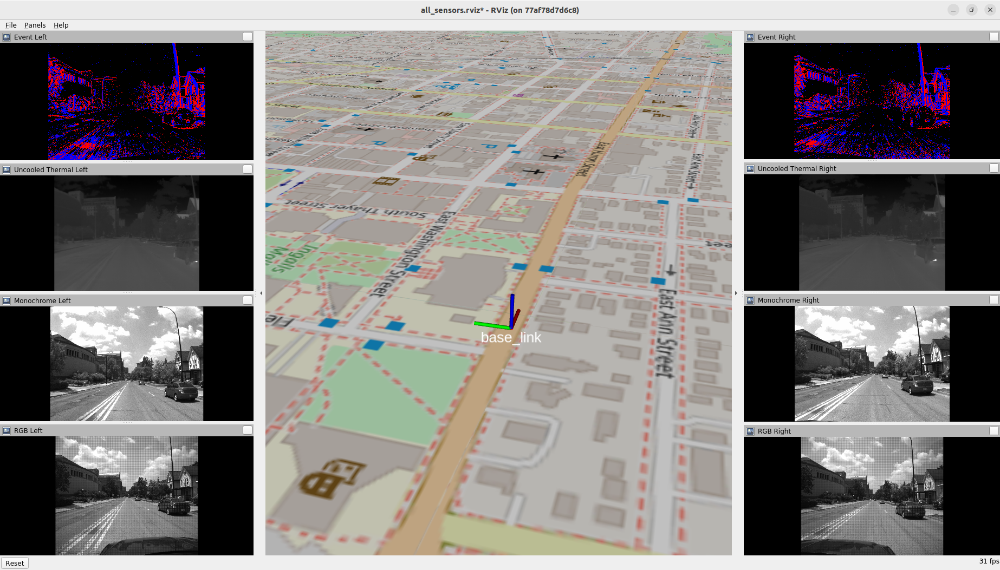
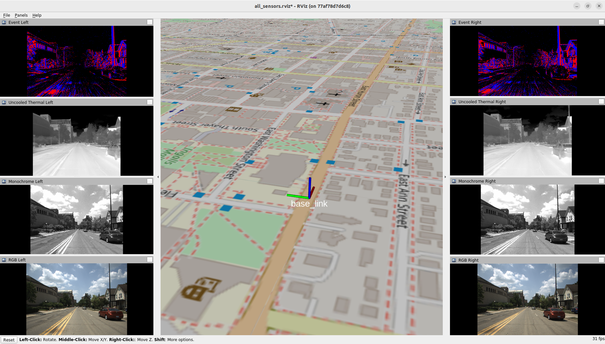
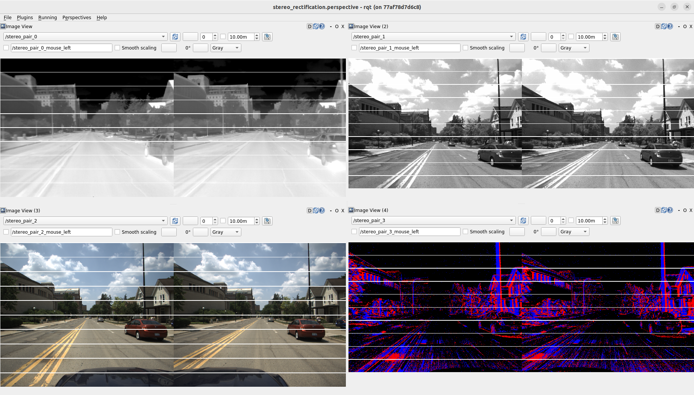
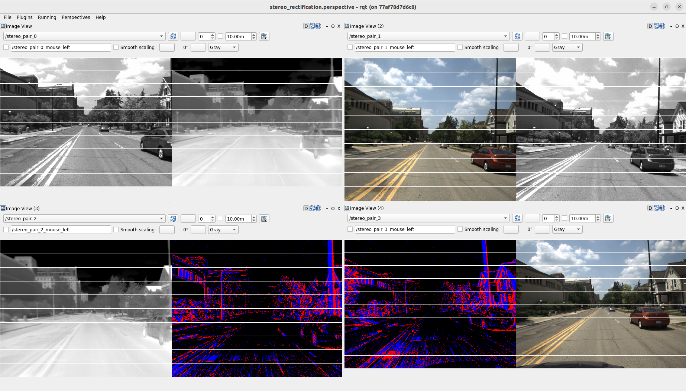
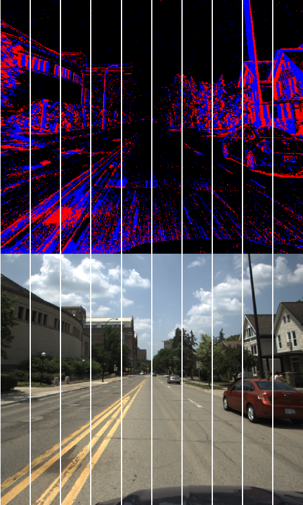
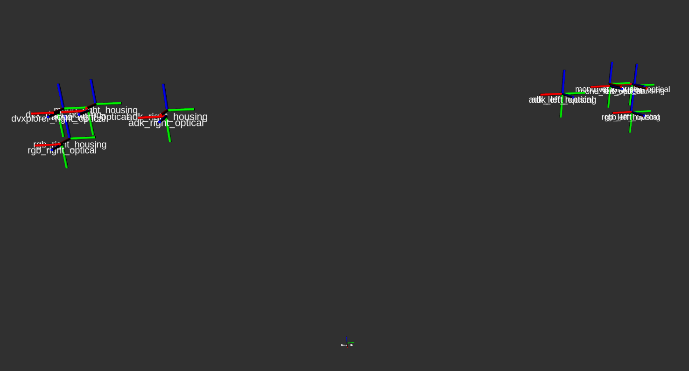

# Preprocessing and Visualization

We provide scripts for performing preprocessing operations (e.g., cropping, debayering, rectification) and visualizing the data.

# 1. Setup

We recommend building and running the preprocessing and visualization code with Docker. This section describes Docker installation, building the `nsavp_preprocessing_and_visualization` Docker image, and running the image with multiple interactive bash sessions. The following has been tested with Ubuntu 22.04.

To begin, install [Docker Engine](https://docs.docker.com/engine/install/ubuntu/) and perform [this](https://docs.docker.com/engine/install/linux-postinstall/#manage-docker-as-a-non-root-user) post-installation step.

After installing Docker, a Docker image for running the code described in this page can be built as follows:
```
cd nsavp_tools/
docker build -t nsavp_preprocessing_and_visualization -f docker/Dockerfile_preprocessing_and_visualization .
```
The result will be a new Docker image named `nsavp_preprocessing_and_visualization` with the `preprocessing_and_visualization` package built in the `/catkin_ws/` directory within the image.

Unless otherwise specified, all commands in subsequent sections are run through an interactive bash session in a Docker container running the `nsavp_preprocessing_and_visualization` image. The following commands will run the image and start an interactive bash session in the running container:
```
xhost +
docker run -it -e DISPLAY=$DISPLAY -v /tmp/.X11-unix:/tmp/.X11-unix -v /path/to/nsavp/data/:/nsavp_data nsavp_preprocessing_and_visualization
```
The arguments `-e DISPLAY=$DISPLAY -v /tmp/.X11-unix:/tmp/.X11-unix` are included to allow display windows to be opened from within the container. The `/path/to/nsavp/data/` path should be replaced with the folder storing NSAVP data on your host machine. This folder will appear within the container as the `/nsavp_data` folder. Once finished, the interactive session can be exited with `Ctrl+D` and the container can be removed by first finding it's name with `docker ps` and then removing it with `docker rm <container name>`.

Running the examples below requires multiple interactive bash sessions in the same Docker container. To open an additional interactive bash session within a running container, open a new terminal window, identify the name of the container with `docker ps`, and finally run:
```
docker exec -it <container_name> bash
```

# 2. Running Preprocessing Operations and Visualization

The `preprocessing_and_visualization.launch` launch file provides a single interface for a variety of preprocessing operations and visualizations of the data. The launch file runs a series of ROS nodes which process NSAVP data when it is played back as ROS messages. Therefore, to use the launch file with a set of NSAVP data, the data must first be converted to the ROS1 rosbag format as described in the [Converting H5 Files to a ROS1 Rosbag File](conversion.md#4-converting-h5-files-to-a-ros1-rosbag-file) section of the conversion documentation page. An example of performing this conversion in order to preprocess and visualize the R0_FA0 sequence is given in the [Examples](#21-examples) section below.

The `preprocessing_and_visualization.launch` launch file takes the following arguments:
- Calibration and manual measurement filepaths
    - `path_calibration_results` **(Required)**: A filepath to the calibration results YAML file for the sequence to be processed.
    - `path_measured_extrinsics`: A filepath to the measured extrinsics YAML file for the sequence to be processed. If provided, the camera housing frames will be visualized with respect to the `base_link` frame in a RViz window. Defaults to an empty string `""`.
- Image preprocessing parameters:
    - `debayer`: A boolean specifying whether (`true`) or not (`false`) to debayer RGB images. Defaults to `true`.
    - `crop_parameters_list`: A nested list containing crop parameters. Each element of the list is a list of crop parameters for an individual camera with the following format `[<camera namespace>,<x offset>,<y offset>,<width>,<height>]`. For example, `[[rgb_left,0,0,600,600],[rgb_right,0,0,600,600]]` crops the left and right RGB images to a 600x600 region in the top left of the images. Any camera not included in the `crop_parameters_list` will not be cropped. See `topic_image_plot` for a method to determine cropping parameters. Defaults to a set of crop parameters which removes the car's hood in the R0_FA0 sequence (in conjunction with the other default parameter values).
    - `crop_raw`: A boolean specifying whether to perform cropping before (`true`) or after (`false`) rectification. If `crop_raw` is `false` and `rectify` is `false`, then no cropping will be performed. Defaults to `false`.
    - `rectify`: A boolean specifying whether (`true`) or not (`false`) to rectify all images. Rectification of bayer encoded images is not supported, so if `debayer` is `false`, `rectify` will be treated as `false` for RGB images, regardless of what value it has been set to. Defaults to `true`.
    - `resolution_rectified`: A two element list specfiying the resolution of all rectified images with the following format: `[<width>,<height>]`. In the case of a monocular camera, if `resolution_rectified` is empty, the rectified resolution will match the resolution of the image input to rectification (which may be cropped from the raw image). In the case of a stereo camera, if `resolution_rectified` is empty, the rectified resolution will match the resolution of the first camera's images input to rectification (the 'first' camera here is `<camera namespace 0>` in the stereo pair, see `stereo_pairs`). Defaults to an empty list `[]`.
    - `stereo_pairs`: A nested list containing pairs of cameras to rectify together. Each element of the list is a two element list with the following format: `[<camera namespace 0>,<camera namespace 1>]`. Any two cameras can be specified as a pair and the script will attempt to rectify them. Rectification may fail if the translation between the two cameras is not predominantly vertical or horizontal (e.g., rectification fails with `[rgb_left,mono_left]` because the translation between the cameras is along the image plane diagonal). An example value for `stereo_pairs` is `[[mono_left,adk_right],[mono_right,adk_left]]`. This would rectify the left monochrome camera with the right thermal camera and the right monochrome camera with the left thermal camera. A camera can be specified in the `stereo_pairs` list only once (e.g. `[[mono_left,adk_right],[mono_left,adk_left]]` will fail as `mono_left` is listed twice). Any camera not included in `stereo_pairs` will be rectified as a monocular camera. Defaults to creating a stereo pair between the left and right camera of each modality.
    - `threshold_thermal`: A boolean specifying whether (`true`) or not (`false`) to threshold thermal images. Thresholding involves the following stages: (1) values less than `threshold_thermal_minimum` are set to `threshold_thermal_minimum`, (2) values greater than `threshold_thermal_maximum` are set to `threshold_thermal_maximum`, (3) the remaining values are normalized between 0 and 255, and (4) the result is converted to an unsigned 8-bit image. Thresholding is performed for visualization because the distribution of values in the raw 16-bit thermal images mainly occupies only a small subset of the 16-bit range and also has long tails. Therefore, linearly mapping the 16-bit range to an 8-bit range or linearly mapping the full range of values present in the image to an 8-bit range results in a low-contrast image. Defaults to `true`.
    - `threshold_thermal_minimum`: An integer specifying the bottom of the thresholded range (see `threshold_thermal`). Defaults to `22500`.
    - `threshold_thermal_maximum`: An integer specifying the top of the thresholded range (see `threshold_thermal`). Defaults to `25000`.
- Data visualization parameters:
    - `visualize_all_sensors`: A boolean specifying whether (`true`) or not (`false`) to display all sensor data (images and ground truth pose) in a RViz window. This display always shows the images after the final stage of preprocessing (i.e., the `/<camera namespace>/image_processed` topics, see the [Image and CameraInfo Messages](#221-image-and-camerainfo-messages) section for more details). Defaults to `true`.
    - `visualize_calibrated_transforms`: A boolean specifying whether (`true`) or not (`false`) to display the camera optical frames alongside the camera housing frames in the RViz window that is created when the `path_measured_extrinsics` filepath is given. The display does not appear if the `path_measured_extrinsics` filepath is left empty. The relative transformations between the optical frames are given by the calibration results file. They are displayed by assuming zero translation between the `adk_left_housing` and `adk_left_optical` frames. Defaults to `false`.
    - `visualize_stereo_rectification`: A boolean specifying whether (`true`) or not (`false`) to display all stereo rectification pairs with lines drawn to assess the quality of the rectification. If `true` a rqt_gui window will be opened to display up to four concatenated images, one for each stereo pair. For each stereo pair, the images are concatenated based on the relative position of the cameras, e.g., for a horizontal stereo pair the images will be concatenated horizontally with the leftmost camera image on the left. Lines are drawn along the concatenation axis to allow the quality of the stereo rectification to be assessed (the lines should cross through the same objects in each image within a pair). Defaults to `false`.
    - `topic_image_plot`: A string specifying a topic to be plot with matplotlib. If given, a matplotlib plot window will be opened displaying (in grayscale) the last image published on the `topic_image_plot` topic before the window was opened. If the window is closed, it will reopen with the most recent image again. This is intended to aid in setting cropping parameters as the matplotlib window allows zooming and displays the cursor's pixel coordinate in the bottom right if it hovers over the image. Defaults to an empty string `""`.

> Note: In this script, events are first processed into event images using the `dvs_renderer` package included in the [rpg_dvs_ros](https://github.com/uzh-rpg/rpg_dvs_ros) event camera driver. These event images, pubished under the `/dvxplorer_left/image_raw` and `/dvxplorer_right/image_raw` topics, are input into the subsequent image preprocessing stages. Alternatively, the individual event pixel coordinates could be rectified (e.g., with OpenCV's `undistortPoints()`) and/or cropped, but this option is not demonstrated here.

## 2.1. Examples

The examples given in this section assume all files from the R0_FA0 sequence have been downloaded and all the H5 files have been converted into a single rosbag `R0_FA0.bag`.

Assuming all files from the R0_FA0 sequence are located in the folder `/nsvap_data/R0_FA0/` within a Docker container running the `nsavp_conversion` image (see the [Setup](conversion.md#1-setup) section of the conversion documentation page) the H5 files can be converted into a single rosbag with the following two commands:
```
roslaunch conversion h5_combine.launch path_base_folder:=/nsavp_data/R0_FA0/ filepath_h5_out:=R0_FA0.h5
roslaunch conversion h5_to_rosbag.launch path_h5_in:=/nsavp_data/R0_FA0/R0_FA0.h5 path_bag_out:=/nsavp_data/R0_FA0/R0_FA0.bag
```
The result would be a new rosbag file, `/nsavp_data/R0_FA0/R0_FA0.bag`. Note that the rosbag format will be significantly larger than the H5 format. For the R0_FA0 sequence the H5 files sum to 139 GB while the rosbag containing all sensors is 320 GB.

These examples can also work with a rosbag containing only a subset of sensors from a single sequence (e.g., if only a subset of the R0_FA0 H5 files were downloaded before running the `h5_combine` and `h5_to_rosbag` commands above), although some visualizations will contain blank sections.

Each of the examples given in subsequent sections are run through an interactive bash session in a Docker container running the `nsavp_preprocessing_and_visualization` image (note that this differs from the commands above which require the `nsavp_conversion` Docker image). It is assumed that the files `R0_FA0.bag`, `R0_FA0_C1_calibration_results.yaml`, and `R0_FA0_M0_measured_extrinsics.yaml` are located in the folder `/nsavp_data/R0_FA0/` in this container.

To run the examples, first run the given `preprocessing_and_visualization.launch` launch file command in one interactive bash session, and then play back the data with `rosbag play` in a separate interactive bash session (see [Setup](#1-setup) for how to start multiple interactive bash sessions). Specifically, the examples given below can be reproduced by running `rosbag play` as follows:
```
rosbag play /nsavp_data/R0_FA0/R0_FA0.bag -s 616
```
where the argument `-s 616` starts play back 616 seconds into the sequence.

### 2.1.1. Visualizing Raw Sensor Data

The raw sensor data can be visualized by first running the following command:
```
roslaunch preprocessing_and_visualization preprocessing_and_visualization.launch path_calibration_results:=/nsavp_data/R0_FA0/R0_FA0_C1_calibration_results.yaml debayer:=false crop_parameters_list:=[] rectify:=false threshold_thermal:=false
```
and then running `rosbag play` in a separate interactive bash session.

A screenshot of the resulting RViz display is shown below. Note that there are several potential issues with the raw image data: the images are distorted (this is most evident in the curved lamppost on the right side of the images), the RGB images are bayer encoded (note the visible grid pattern), and the hood of the car is visible in the event and RGB images. Additionally, the thermal image is somewhat hard to interpret as it is low contrast.

> Note: RViz internally normalizes 16-bit images so the thermal image visualization here is not a direct reflection of their raw values.

In the center, the `base_link` pose is visualized in an OpenStreetMap map (using the [rviz_satellite](https://github.com/nobleo/rviz_satellite) ROS package). Note that in all RViz pose visualizations, red corresponds to the x-axis, green corresponds to the y-axis, and blue corresponds to the z-axis (this can be remembered as RGB mapping to xyz).



### 2.1.2. Performing Various Image Preprocessing Operations and Visualizing Sensor Data

The default parameters values in the `preprocessing_and_visualization.launch` launch file are set to correct the issues described in the previous subsection. Specifically, the RGB images are debayered, all images are rectified, the car's hood is cropped out of the rectified event and RGB images, and the thermal images are thresholded. Note that cropping after rectification preserves slightly more information than cropping before rectification. These image preprocessing operations can be run and the resulting sensor data can be visualized by first running the following command:
```
roslaunch preprocessing_and_visualization preprocessing_and_visualization.launch path_calibration_results:=/nsavp_data/R0_FA0/R0_FA0_C1_calibration_results.yaml
```
and then running `rosbag play` in a separate interactive bash session.

A screenshot of the resulting RViz display is shown below.



### 2.1.3. Visualizing Rectified Stereo Pairs and Performing Cross-Modality Stereo Rectification

The default parameters values in the `preprocessing_and_visualization.launch` launch file are set such that stereo rectification is performed between the left and right camera of each modality. The stereo rectification of these cameras can be visualized by first running the following command:
```
roslaunch preprocessing_and_visualization preprocessing_and_visualization.launch path_calibration_results:=/nsavp_data/R0_FA0/R0_FA0_C1_calibration_results.yaml visualize_all_sensors:=false visualize_stereo_rectification:=true
```
and then running `rosbag play` in a separate interactive bash session.

A screenshot of the resulting rqt_gui display is shown below. Note that within all stereo pairs the horizontal lines cross through the same objects in each image. This indicates the calibration results are accurate and stereo rectification was successful.



The script also supports stereo rectification between cameras of different modalities. This can be demonstrated by first running the following command:
```
roslaunch preprocessing_and_visualization preprocessing_and_visualization.launch path_calibration_results:=/nsavp_data/R0_FA0/R0_FA0_C1_calibration_results.yaml visualize_all_sensors:=false visualize_stereo_rectification:=true stereo_pairs:=[[mono_left,adk_right],[rgb_left,mono_right],[adk_left,dvxplorer_right],[dvxplorer_left,rgb_right]]
```
and then running `rosbag play` in a separate interactive bash session.

A screenshot of the resulting rqt_gui display is shown below.



In addition, the script supports stereo rectification with vertical baselines, for example between the left RGB and left event cameras. This can be demonstrated by first running the following command:
```
roslaunch preprocessing_and_visualization preprocessing_and_visualization.launch path_calibration_results:=/nsavp_data/R0_FA0/R0_FA0_C1_calibration_results.yaml visualize_all_sensors:=false visualize_stereo_rectification:=true stereo_pairs:=[[rgb_left,dvxplorer_left]]
```
and then running `rosbag play` in a separate interactive bash session.

A screenshot of the resulting rqt_gui display is shown below.



### 2.1.4. Visualizing Camera Housing and Optical Frames

The camera housing and optical frames can be viewed by first running the following command:
```
roslaunch preprocessing_and_visualization preprocessing_and_visualization.launch path_calibration_results:=/nsavp_data/R0_FA0/R0_FA0_C1_calibration_results.yaml path_measured_extrinsics:=/nsavp_data/R0_FA0/R0_FA0_M0_measured_extrinsics.yaml visualize_all_sensors:=false visualize_calibrated_transforms:=true
```
and then running `rosbag play` in a separate interactive bash session.

A screenshot of the resulting RViz display is shown below. The frames and their IDs overlap, but each frame can be toggled from the RViz display by clicking `Panels` then `Displays` and clicking the checkboxes next to the frame IDs.

As mentioned above, the optical frames are visualized with respect to the housing frames by assuming zero translation between the `adk_left_housing` and `adk_left_optical` frames. The origins of these two frames are therefore coincident in the visualization by definition. Small offsets are visible between the right camera housing and optical frames, possibly due to errors in manual measurement.



## 2.2. Additional Details

### 2.2.1. Image and CameraInfo Messages

The `image_preprocessing.py` script, run by the `preprocessing_and_visualization.launch` launch file, performs image preprocessing operations, publishes [Image](http://docs.ros.org/en/noetic/api/sensor_msgs/html/msg/Image.html) messages at each stage of processing, and publishes [CameraInfo](http://docs.ros.org/en/noetic/api/sensor_msgs/html/msg/CameraInfo.html) messages containing calibration and rectification information for each camera.

The possible image topics are as follows (using the naming scheme outlined in the [CameraInfo](https://docs.ros.org/en/noetic/api/sensor_msgs/html/msg/CameraInfo.html) documentation where possible):
- `image_raw`: raw (distorted, full resolution, possibly bayer encoded)
- `image_color`: distorted, debayered
- `image_crop`: distorted, cropped (possibly bayer encoded)
- `image_crop_color`: distorted, debayered then cropped
- `image_rect`: rectified
- `image_rect_color`: debayered, rectified
- `image_crop_rect`: cropped then rectified
- `image_crop_rect_color`: debayered, cropped then rectified
- `image_rect_crop`: rectified then cropped
- `image_rect_color_crop`: debayered, rectified then cropped
- `image_raw_thresholded`: distorted, thresholded
- `image_crop_thresholded`: distorted, cropped then thresholded
- `image_rect_thresholded`: rectified then thresholded
- `image_crop_rect_thresholded`: cropped then rectified and thresholded
- `image_rect_crop_thresholded`: rectified then cropped and thresholded
- `image_processed`: image after the final stage of preprocessing (used for RViz visualization)

For each `/<camera namespace>/image_raw` topic a synchronized `CameraInfo` message is published under the topic `/<camera namespace>/camera_info`. The `CameraInfo` message contains the information necessary to rectify the raw image according to the launch file arguments. We set the `width` and `height` fields of the `CameraInfo` messages to that of the rectified resolution. This violates the ROS standard which does not allow for a differing resolution between raw and rectified images (see [ROS REP 104](https://ros.org/reps/rep-0104.html)), but this is required for rectifying stereo images with different raw resolutions. We also use it here to support arbitrary rectified resolutions (i.e., the `resolution_rectified` launch file argument described above).

### 2.2.2. TF2 Transforms

The `pose_visualization.py` script, run by the `preprocessing_and_visualization.launch` launch file, broadcasts transforms through [TF2](http://wiki.ros.org/tf2) for the `base_link` and, optionally, the camera housing frames (if the `path_measured_extrinsics` filepath is provided). It also publishes [NavSatFix](http://docs.ros.org/en/noetic/api/sensor_msgs/html/msg/NavSatFix.html) messages for visualization with `rviz_satellite`. It is consistent with [ROS REP 103](https://www.ros.org/reps/rep-0103.html) and [ROS REP 105](https://www.ros.org/reps/rep-0105.html), with the exception that we do not use an `odom` frame here. Specifically, the coordinate frame tree from parent to child is as follows:
1. `earth`: Earth Centered Earth Fixed (ECEF) frame
2. `map`: East North Up (ENU) frame centered at the first `base_link` position processed by `pose_visualization.py`
3. `base_link`: origin on the ground at the midpoint of the vehicle's rear wheels with the x-axis pointing forward, y-axis pointing left, and z-axis pointing up
4. `<camera namespace>_housing`: camera housing frames (e.g. `mono_left_housing`), defined in the measured extrinsics files

The `image_preprocessing.py` script, described in the previous subsection, also broadcasts the chain of transforms between the camera optical frames described in the calibration results file. If the `visualize_calibrated_transforms` launch file argument is set to `true`, it additionally broadcasts a transform between the `adk_left_housing` and `adk_left_optical` frames.
