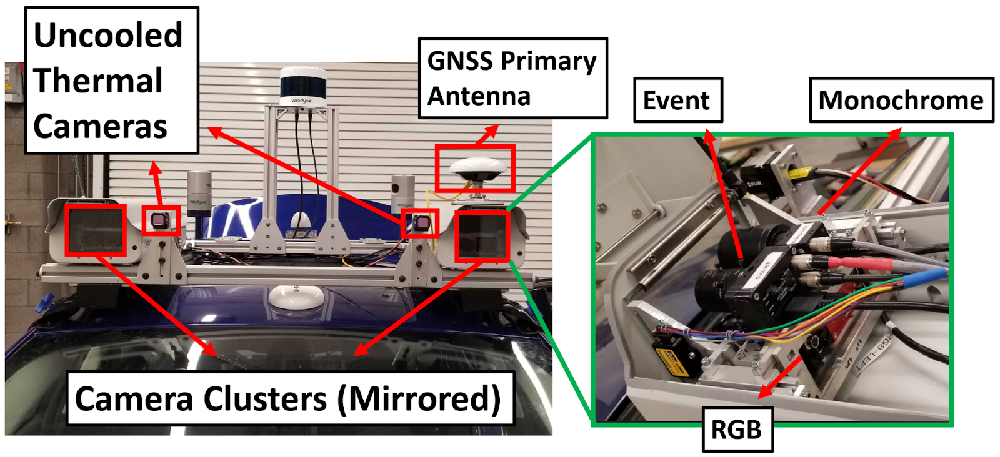

# Sensors

The sensors utilized in the NSAVP dataset (with the exception of the Applanix POS LV 420 secondary antenna, IMU, and wheel encoder) are labeled in the image below. The right side of the diagram shows a look inside the left camera cluster enclosure. The right camera cluster contains the same sensors in a mirrored configuration of the left, i.e. in each enclosure, the monochrome camera is on the innermost side.

## 1. Stereo Cameras

An overview of the stereo cameras included in the NSAVP dataset is given in the table below:

| Type             | Camera Model        | Lens Model              | Stereo Baseline (meters) | FOV (H x V) (degrees) | Resolution (W x H) | Rate (Hz) | Bit Depth (Bits) | Frame Readout |
|------------------|---------------------|-------------------------|--------------------------|-----------------------|--------------------|-----------|------------------|---------------|
| Monochrome       | FLIR BFS-PGE-16S2M  | Computar A4Z2812CS-MPIR | 0.90                     | 70 x 55               | 1440 x 1080        | 20.14     | 8                | Global        |
| RGB              | FLIR BFS-PGE-50S5C  | Fujinon HF6XA-5M        | 1.00                     | 70 x 60               | 1224 x 1024        | 20.14     | 8                | Global        |
| Uncooled Thermal | FLIR 40640U050-6PAAX| NA (Integrated)         | 0.64                     | 50 x 40               | 640 x 512          | 60.42     | 16               | Rolling       |
| Event (DVS)      | Inivation DVXplorer | NA (Included)           | 1.00                     | 70 x 50               | 640 x 480          | NA        | NA               | NA            |

Extensive configuration and calibration information is provided with each sequence of the dataset. See the [Data Format](data_format.md) file for an explanation of where to find this information.

## 2. Groundtruth

Ground truth pose was recorded with an Applanix POS-LV 420: a navigation system featuring a dual antenna GNSS receiver, IMU, and wheel encoder. The data was postprocessed with the Applanix POSPac Mobile Mapping Suite (MMS) to obtain highly accurate vehicle poses at 200 Hz. The absolute position error is typically within several centimeters and the orientation error is typically within several hundreths of a degree.
